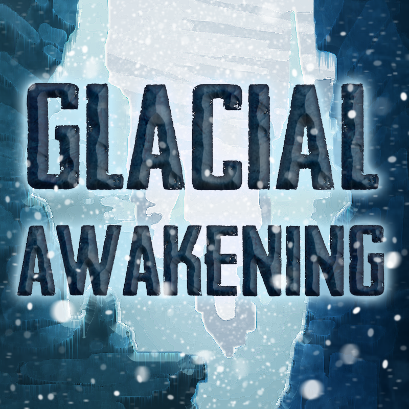

# Glacial Awakening

 

*You wake up in a small, dark cavern deep within a glacier. Maybe you can find your way out of the glacier, but that's only the first challenge...* • [CurseForge](https://www.curseforge.com/minecraft/modpacks/glacial-awakening) • [Changelog](config/mputils/changelog.txt) • [Bugtracker](https://github.com/Dark-Arcana/glacial-awakening/issues)

&nbsp;

## Introduction

Glacial Awakening is a unique questing pack where you start locked away in a pitch-black 3x3 chamber deep inside a glacier. Breaking out of this chamber resembles the experience of a skyblock where you have limited space and limited resources. Once you break out of this chamber and reach the surface you are guided through an interesting progression surviving in the endless expanse of ice and snow.

Coming in at about 150 mods, this pack loads quick and performs well on potato computers, but still remains a unique hand-crafted and engaging experience that can provide dozens of hours of fun.
Please submit issues and suggestions to this repo for my modpack [Glacial Awakening](https://minecraft.curseforge.com/projects/glacial-awakening).
Come hang out on [Official Discord](https://discord.gg/4swu3fy) to chat about the pack.
